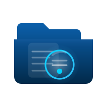

<p align="center">
  
</p>

<h1 align="center">SGDEA</h1>
<h3 align="center">Sistema de Gestión Documental Electrónica y Archivo</h3>

<p align="center">
  
  
  
  
  
</p>

<p align="center">
  <strong>Plataforma multi-tenant para gestión de facturas electrónicas con importación masiva, OCR de PDFs y auditoría completa.</strong>
</p>

---

## 📋 Tabla de Contenidos

- [Descripción](#-descripción)
- [Características](#-características)
- [Arquitectura](#-arquitectura)
- [Requisitos](#-requisitos)
- [Instalación](#-instalación)
- [Configuración](#-configuración)
- [Uso](#-uso)
- [API](#-api)
- [Estructura del Proyecto](#-estructura-del-proyecto)
- [Desarrollo](#-desarrollo)
- [Testing](#-testing)
- [Despliegue](#-despliegue)
- [Contribución](#-contribución)
- [Licencia](#-licencia)

---

## 🎯 Descripción

**SGDEA** es un sistema empresarial diseñado para la gestión integral de facturas electrónicas en Colombia. Permite a las organizaciones:

- **Importar masivamente** facturas desde archivos Excel
- **Procesar PDFs** con OCR para extraer y asociar documentos automáticamente
- **Gestionar terceros** (clientes/proveedores) con detección de duplicados
- **Visualizar dashboards** con KPIs y estadísticas en tiempo real
- **Auditar** todas las acciones del sistema para cumplimiento normativo

El sistema es **multi-tenant**, lo que permite que múltiples empresas utilicen la misma instancia con datos completamente aislados.

---

## ✨ Características

### 🏢 Multi-Tenant
- Aislamiento completo de datos por empresa
- Personalización de marca (logo, colores, tema)
- Configuración independiente por tenant
- Administrador global para gestionar todos los tenants

### 📄 Gestión de Facturas
- Importación masiva desde Excel (.xlsx, .xls)
- Soporte para CUFE (Código Único de Factura Electrónica)
- Estados: Pendiente, Aceptado, Rechazado, Pagado, Anulado
- Búsqueda y filtrado avanzado
- Exportación a Excel/PDF

### 📁 Procesamiento de PDFs
- Extracción de texto con OCR (poppler-utils)
- Identificación automática de CUFEs en documentos
- Separación de PDFs multi-página
- Asociación automática PDF-Factura
- Almacenamiento seguro en storage privado

### 👥 Gestión de Terceros
- Directorio de clientes/proveedores
- Detección de duplicados por NIT
- Fusión de terceros duplicados
- Historial de facturas por tercero
- Estadísticas de facturación

### 📊 Dashboard y Reportes
- KPIs en tiempo real (ventas, pendientes, morosidad)
- Gráficos de evolución mensual
- Distribución por estado de facturas
- Top terceros por facturación
- Filtros por período y tercero

### 🔐 Seguridad y Auditoría
- Autenticación segura con hash bcrypt
- Sistema de roles y permisos granular
- Registro de auditoría inmutable
- Aprobación de nuevos usuarios
- Sesiones con control de IP

### 🎨 Interfaz de Usuario
- Diseño moderno con Tailwind CSS 4
- Modo claro/oscuro
- Totalmente responsive
- Componentes reutilizables con Blade
- Interactividad con Alpine.js y Livewire

---

## 🏗 Arquitectura

```
┌─────────────────────────────────────────────────────────────┐
│                        FRONTEND                              │
│  ┌─────────────┐  ┌─────────────┐  ┌─────────────────────┐  │
│  │  Blade      │  │  Alpine.js  │  │  Livewire 3         │  │
│  │  Templates  │  │  Components │  │  Real-time UI       │  │
│  └─────────────┘  └─────────────┘  └─────────────────────┘  │
│                    Tailwind CSS 4                            │
├─────────────────────────────────────────────────────────────┤
│                        BACKEND                               │
│  ┌─────────────────────────────────────────────────────┐    │
│  │                   Laravel 12.x                       │    │
│  │  ┌───────────┐  ┌───────────┐  ┌───────────────┐    │    │
│  │  │Controllers│  │ Services  │  │ Livewire      │    │    │
│  │  │           │  │           │  │ Components    │    │    │
│  │  └───────────┘  └───────────┘  └───────────────┘    │    │
│  │  ┌───────────┐  ┌───────────┐  ┌───────────────┐    │    │
│  │  │  Models   │  │Middleware │  │   Policies    │    │    │
│  │  │ Eloquent  │  │           │  │               │    │    │
│  │  └───────────┘  └───────────┘  └───────────────┘    │    │
│  └─────────────────────────────────────────────────────┘    │
├─────────────────────────────────────────────────────────────┤
│                      SERVICIOS                               │
│  ┌──────────────┐  ┌──────────────┐  ┌────────────────┐     │
│  │ ImportService│  │  PdfService  │  │DashboardService│     │
│  │ Excel Parser │  │ OCR/pdftotext│  │  KPIs/Charts   │     │
│  └──────────────┘  └──────────────┘  └────────────────┘     │
├─────────────────────────────────────────────────────────────┤
│                    INFRAESTRUCTURA                           │
│  ┌─────────────┐  ┌─────────────┐  ┌─────────────────┐      │
│  │   MySQL 8   │  │    Redis    │  │  File Storage   │      │
│  │  Database   │  │   (Cache)   │  │  (PDFs/Logos)   │      │
│  └─────────────┘  └─────────────┘  └─────────────────┘      │
│                      Docker Compose                          │
└─────────────────────────────────────────────────────────────┘
```

### Stack Tecnológico

| Capa | Tecnología | Versión |
|------|------------|---------|
| **Framework** | Laravel | 12.x |
| **Lenguaje** | PHP | 8.2+ |
| **Base de Datos** | MySQL | 8.0+ |
| **Frontend CSS** | Tailwind CSS | 4.x |
| **Frontend JS** | Alpine.js | 3.x |
| **Real-time UI** | Livewire | 3.x |
| **Gráficos** | Chart.js | 4.x |
| **Excel** | PhpSpreadsheet | 5.x |
| **PDF OCR** | Poppler Utils | - |
| **Contenedores** | Docker | 24+ |

---

## 📦 Requisitos

### Desarrollo Local (Docker)
- Docker Desktop 24+
- Docker Compose 2+
- 4GB RAM mínimo
- 10GB espacio en disco

### Producción
- PHP 8.2+ con extensiones: BCMath, Ctype, JSON, Mbstring, OpenSSL, PDO, Tokenizer, XML, GD
- MySQL 8.0+ o MariaDB 10.6+
- Nginx o Apache
- Composer 2.x
- Node.js 18+ (para compilar assets)
- Poppler Utils (para OCR de PDFs)
- Redis (opcional, para caché y colas)

---

## 🚀 Instalación

### Opción 1: Docker (Recomendado)

```bash
# 1. Clonar el repositorio
git clone https://github.com/tu-usuario/sgdea.git
cd sgdea

# 2. Copiar archivo de entorno
cp laravel/.env.example laravel/.env

# 3. Iniciar contenedores
docker-compose up -d

# 4. Instalar dependencias
docker exec sgdea_app composer install
docker exec sgdea_app npm install

# 5. Generar clave de aplicación
docker exec sgdea_app php artisan key:generate

# 6. Ejecutar migraciones y seeders
docker exec sgdea_app php artisan migrate:fresh --seed --force

# 7. Compilar assets
docker exec sgdea_app npm run build:copy

# 8. Acceder al sistema
# URL: http://localhost:8080
# Usuario: admin@demo.sgdea.local
# Contraseña: Admin123!
```

### Opción 2: Instalación Manual

```bash
# 1. Clonar y entrar al directorio
git clone https://github.com/tu-usuario/sgdea.git
cd sgdea/laravel

# 2. Instalar dependencias PHP
composer install

# 3. Instalar dependencias JS
npm install

# 4. Configurar entorno
cp .env.example .env
php artisan key:generate

# 5. Configurar base de datos en .env
# DB_CONNECTION=mysql
# DB_HOST=127.0.0.1
# DB_PORT=3306
# DB_DATABASE=sgdea
# DB_USERNAME=root
# DB_PASSWORD=secret

# 6. Ejecutar migraciones
php artisan migrate:fresh --seed

# 7. Compilar assets
npm run build
node copyassets.js

# 8. Iniciar servidor
php artisan serve
```

---

## ⚙️ Configuración

### Variables de Entorno Principales

```env
# Aplicación
APP_NAME=SGDEA
APP_ENV=production
APP_DEBUG=false
APP_URL=https://tu-dominio.com

# Base de Datos
DB_CONNECTION=mysql
DB_HOST=mysql
DB_PORT=3306
DB_DATABASE=sgdea
DB_USERNAME=sgdea_user
DB_PASSWORD=secure_password

# Cache y Sesiones
CACHE_DRIVER=redis
SESSION_DRIVER=redis
QUEUE_CONNECTION=redis

# Redis
REDIS_HOST=redis
REDIS_PORT=6379

# Mail (para notificaciones)
MAIL_MAILER=smtp
MAIL_HOST=smtp.mailtrap.io
MAIL_PORT=587
MAIL_USERNAME=null
MAIL_PASSWORD=null

# Storage
FILESYSTEM_DISK=local
```

### Permisos de Archivos (Linux/Mac)

```bash
chmod -R 775 storage bootstrap/cache
chown -R www-data:www-data storage bootstrap/cache
```

---

## 📖 Uso

### Credenciales de Demostración

| Usuario | Contraseña | Rol | Permisos |
|---------|------------|-----|----------|
| admin@demo.sgdea.local | Admin123! | Administrador | Todos |
| supervisor@demo.sgdea.local | Supervisor123! | Supervisor | Sin eliminar |
| operador@demo.sgdea.local | Operador123! | Operador | Básicos |
| consultor@demo.sgdea.local | Consultor123! | Consultor | Solo lectura |

### Flujo de Trabajo Típico

```
[Importar Excel] → [Crear Facturas] → [Importar PDFs] → [Asociar PDFs] → [Dashboard] → [Exportar]
```

### 1. Importar Facturas desde Excel

1. Ir a **Importaciones** en el menú lateral
2. Seleccionar archivo Excel (.xlsx)
3. Verificar mapeo de columnas
4. Confirmar importación
5. Revisar resultados

**Columnas esperadas en Excel:**

| Columna | Campo | Requerido |
|---------|-------|-----------|
| Documento | numero_factura | ✅ |
| Prefijo | prefijo | ❌ |
| UUID/CUFE | cufe | ✅ |
| Identificación | nit | ✅ |
| Comprador | nombre_cliente | ✅ |
| Fecha de Emisión | fecha_factura | ✅ |
| Valor Total | total | ✅ |
| Estado Comercial | estado | ❌ |

### 2. Procesar PDFs

1. Ir a **Importaciones** → pestaña PDF
2. Arrastrar archivos PDF
3. El sistema extrae CUFEs automáticamente
4. Confirmar asociación con facturas
5. Los PDFs se guardan en storage privado

### 3. Gestionar Terceros

1. Ir a **Terceros** en el menú
2. Ver listado de clientes/proveedores
3. Detectar duplicados con el botón "Buscar duplicados"
4. Seleccionar terceros a fusionar
5. Elegir el tercero dominante
6. Confirmar fusión

---

## 🔌 API

### Endpoints Disponibles

```
GET  /api/dashboard/data          # Datos del dashboard
GET  /api/dashboard/terceros      # Búsqueda de terceros
GET  /api/terceros/search-duplicates  # Buscar duplicados
```

### Autenticación

Las rutas API están protegidas por el middleware `auth`. Se requiere sesión activa o token.

---

## 📁 Estructura del Proyecto

```
sgdea/
├── docker/                    # Configuración Docker
│   ├── mysql/
│   ├── nginx/
│   └── php/
├── docs/                      # Documentación
│   └── desarrollo/
│       ├── PLAN_UIX_SGDEA.md
│       ├── ESTADO_EJECUCION_UIX.md
│       └── PROMPTS_UIX_SGDEA.md
├── laravel/                   # Aplicación Laravel
│   ├── app/
│   │   ├── Http/
│   │   │   ├── Controllers/
│   │   │   ├── Middleware/
│   │   │   └── Livewire/
│   │   ├── Models/
│   │   ├── Services/
│   │   └── Policies/
│   ├── config/
│   ├── database/
│   │   ├── migrations/
│   │   └── seeders/
│   ├── public/
│   │   ├── css/
│   │   ├── js/
│   │   └── images/
│   ├── resources/
│   │   ├── css/
│   │   ├── js/
│   │   └── views/
│   │       ├── components/
│   │       ├── layouts/
│   │       ├── livewire/
│   │       └── partials/
│   ├── routes/
│   ├── storage/
│   └── tests/
├── docker-compose.yml
└── README.md
```

### Componentes Principales

| Directorio | Contenido |
|------------|-----------|
| `app/Http/Controllers/` | Controladores de la aplicación |
| `app/Http/Livewire/` | Componentes Livewire (FacturasTable, TercerosTable, ImportWizard) |
| `app/Services/` | Servicios de negocio (ImportService, PdfService, DashboardService) |
| `app/Models/` | Modelos Eloquent |
| `resources/views/components/` | Componentes Blade reutilizables |
| `resources/views/layouts/` | Layouts principales (sgdea.blade.php) |
| `resources/views/livewire/` | Vistas de componentes Livewire |

---

## 💻 Desarrollo

### Comandos Útiles

```bash
# Limpiar cachés
docker exec sgdea_app php artisan cache:clear
docker exec sgdea_app php artisan view:clear
docker exec sgdea_app php artisan route:clear
docker exec sgdea_app php artisan config:clear

# Compilar assets
docker exec sgdea_app npm run build:copy

# Ver rutas
docker exec sgdea_app php artisan route:list

# Crear migración
docker exec sgdea_app php artisan make:migration create_example_table

# Crear modelo con migración
docker exec sgdea_app php artisan make:model Example -m

# Crear controlador
docker exec sgdea_app php artisan make:controller ExampleController

# Crear componente Livewire
docker exec sgdea_app php artisan make:livewire ExampleComponent
```

### Debug Commands

```bash
# Debug de importación Excel
docker exec sgdea_app php artisan debug:importacion public/test.xlsx --preview

# Debug de procesamiento PDF
docker exec sgdea_app php artisan debug:pdf public/archivo.pdf --cufes

# Debug de dashboard
docker exec sgdea_app php artisan debug:dashboard --tenant=1 --test=kpis
```

### Convenciones de Código

- **PSR-12** para estilo de código PHP
- **Nombres de tablas**: plural, snake_case (`facturas`, `import_logs`)
- **Nombres de modelos**: singular, PascalCase (`Factura`, `ImportLog`)
- **Migraciones**: con comentarios en cada campo
- **Commits**: Conventional Commits (feat:, fix:, docs:, etc.)

---

## 🧪 Testing

```bash
# Ejecutar todos los tests
docker exec sgdea_app php artisan test

# Tests con cobertura
docker exec sgdea_app php artisan test --coverage

# Test específico
docker exec sgdea_app php artisan test --filter=FacturaTest
```

---

## 🚢 Despliegue

### Requisitos de Producción

1. Servidor con PHP 8.2+, MySQL 8+, Nginx
2. SSL/HTTPS configurado
3. Poppler Utils instalado (`apt install poppler-utils`)
4. Redis para caché y colas

### Pasos de Despliegue

```bash
# 1. Clonar repositorio
git clone https://github.com/tu-usuario/sgdea.git /var/www/sgdea

# 2. Instalar dependencias (sin dev)
composer install --no-dev --optimize-autoloader
npm ci && npm run build && node copyassets.js

# 3. Configurar entorno
cp .env.example .env
# Editar .env con valores de producción

# 4. Generar clave
php artisan key:generate

# 5. Ejecutar migraciones
php artisan migrate --force

# 6. Optimizar
php artisan config:cache
php artisan route:cache
php artisan view:cache

# 7. Configurar permisos
chown -R www-data:www-data storage bootstrap/cache
chmod -R 775 storage bootstrap/cache
```

### Configuración Nginx

```nginx
server {
    listen 80;
    server_name tu-dominio.com;
    root /var/www/sgdea/laravel/public;

    index index.php;

    location / {
        try_files $uri $uri/ /index.php?$query_string;
    }

    location ~ \.php$ {
        fastcgi_pass unix:/var/run/php/php8.2-fpm.sock;
        fastcgi_param SCRIPT_FILENAME $realpath_root$fastcgi_script_name;
        include fastcgi_params;
    }

    location ~ /\.(?!well-known).* {
        deny all;
    }
}
```

---

## 🤝 Contribución

1. Fork el proyecto
2. Crear rama feature (`git checkout -b feature/nueva-funcionalidad`)
3. Commit cambios (`git commit -m 'feat: agregar nueva funcionalidad'`)
4. Push a la rama (`git push origin feature/nueva-funcionalidad`)
5. Abrir Pull Request

---

## 📄 Licencia

Este proyecto está bajo la Licencia MIT. Ver el archivo [LICENSE](LICENSE) para más detalles.

---

## 📞 Soporte

- **Documentación**: `docs/desarrollo/`
- **Issues**: GitHub Issues
- **Email**: soporte@sgdea.com

---

<p align="center">
  Desarrollado con ❤️ usando Laravel, Tailwind CSS y Livewire
</p>

